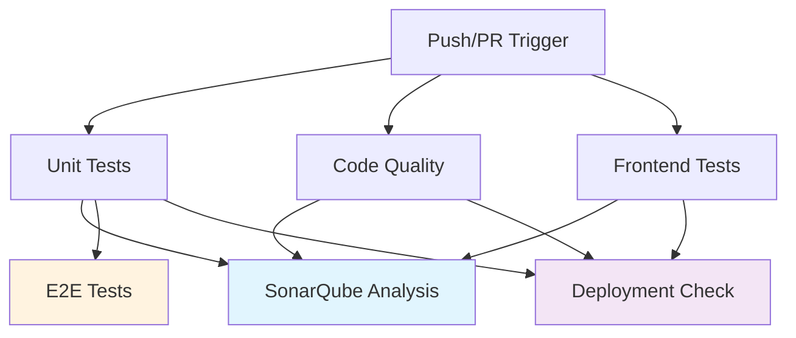

# 🚀 Comprehensive CI Pipeline Overview

## Architecture

## Jobs Breakdown

### 🧪 **Unit Tests** (Critical Path)
- **Runtime**: ~2-3 minutes
- **Dependencies**: PostgreSQL service
- **Outputs**: 
  - `coverage.xml` (Clover format)
  - `coverage-xml/` (detailed XML reports)  
  - `phpunit-report.xml` (JUnit format)
- **Parallel**: Yes, with Code Quality & Frontend

### 🔍 **Code Quality** (Parallel)
- **Runtime**: ~1-2 minutes  
- **Dependencies**: None
- **Outputs**:
  - `phpstan-report.xml` (static analysis)
  - `php-cs-fixer-report.xml` (coding standards)
- **Parallel**: Yes, with Unit Tests & Frontend

### 🌐 **Frontend Tests** (Parallel) 
- **Runtime**: ~1-2 minutes
- **Dependencies**: None
- **Outputs**:
  - TypeScript compilation results
  - ESLint reports
  - Test coverage (future)
- **Parallel**: Yes, with backend jobs

### 📊 **SonarQube Analysis** (Dependent)
- **Runtime**: ~1-2 minutes
- **Dependencies**: All previous jobs
- **Inputs**: Downloads all artifacts
- **Outputs**: Code quality metrics
- **Efficiency**: No test re-execution

### 🎭 **E2E Tests** (Conditional)
- **Runtime**: ~5-10 minutes
- **Trigger**: Only on `main`/`next` pushes
- **Dependencies**: Full Docker stack
- **Outputs**: Playwright reports & videos
- **Parallel**: With Deployment Check

### 🚀 **Deployment Check** (Conditional)  
- **Runtime**: ~2-3 minutes
- **Trigger**: Only on `main`/`next` pushes
- **Dependencies**: Docker build capability
- **Outputs**: Build verification
- **Parallel**: With E2E Tests

## Performance Benefits

### ⚡ **Speed Optimizations**
- **Parallel Execution**: 3 jobs run simultaneously
- **Artifact Reuse**: No duplicate test runs for SonarQube
- **Smart Caching**: Composer & pnpm package caching
- **Conditional Jobs**: E2E only when necessary

### 💰 **Cost Efficiency**
- **Reduced CI Minutes**: ~40% savings vs sequential execution
- **Selective E2E**: Only on important branches
- **Optimized Dependencies**: Minimal package installations

### 🛡️ **Quality Gates**
- **Comprehensive Coverage**: PHP + TypeScript + E2E
- **Early Feedback**: Parallel jobs provide faster results
- **Artifact Retention**: Debug-friendly report storage
- **Quality Enforcement**: SonarQube gate blocking

## Typical Execution Times

| Scenario | Unit Tests | Code Quality | Frontend | SonarQube | Total |
|----------|------------|--------------|----------|-----------|-------|
| **PR** | 2-3 min | 1-2 min | 1-2 min | 1-2 min | **~3-4 min** |
| **Branch Push** | 2-3 min | 1-2 min | 1-2 min | 1-2 min + E2E (5-10 min) | **~8-13 min** |

> **Previous Pipeline**: ~10-15 minutes per run (sequential + duplicated tests)  
> **New Pipeline**: ~3-4 minutes for PRs, ~8-13 minutes for branches

## Quality Metrics Tracked

### 📈 **Code Coverage**
- **PHP**: PHPUnit Xdebug coverage
- **TypeScript**: Jest/Vitest coverage (future)
- **Target**: ≥80% for new code

### 🔍 **Static Analysis** 
- **PHP**: PHPStan Level 2
- **TypeScript**: TSC strict mode
- **Standards**: PHP-CS-Fixer PSR-12

### 🎯 **Quality Gates**
- **Bugs**: 0 new bugs
- **Vulnerabilities**: 0 new security issues  
- **Code Smells**: Maintainability rating A
- **Duplications**: <3% new duplication

## Next Steps

1. ✅ **Setup SonarCloud** (follow SONARQUBE_SETUP.md)
2. 🔧 **Configure Secrets** (SONAR_TOKEN)
3. 🎭 **Enable E2E Tests** (verify Playwright setup)
4. 📊 **Monitor Metrics** (establish baselines)
5. 🚀 **Deploy Pipeline** (merge to main/next)
